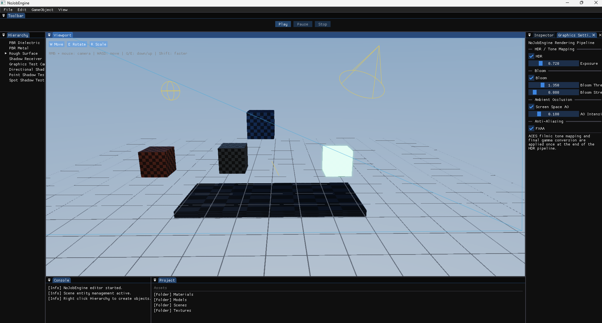
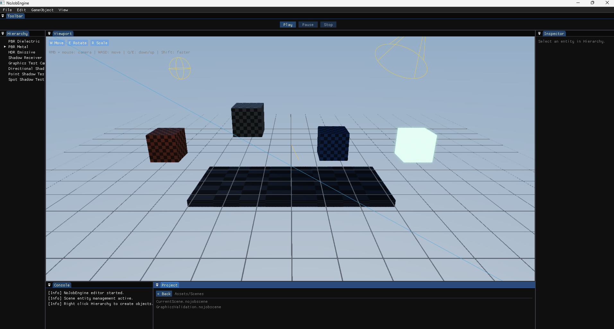
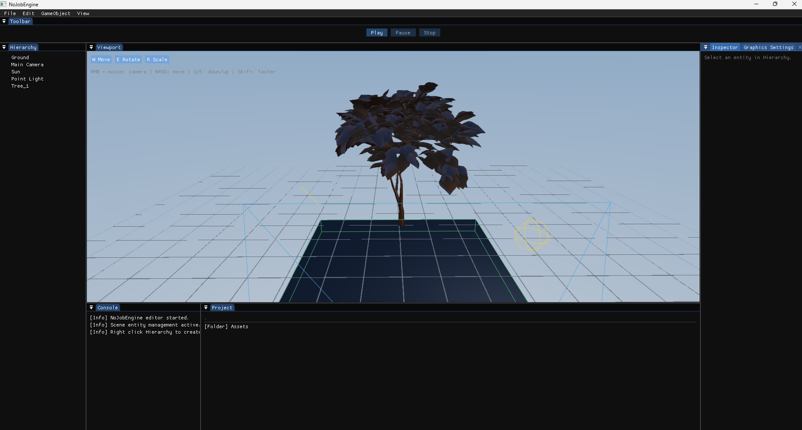
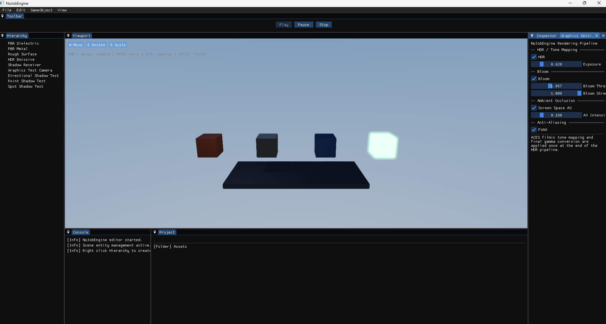
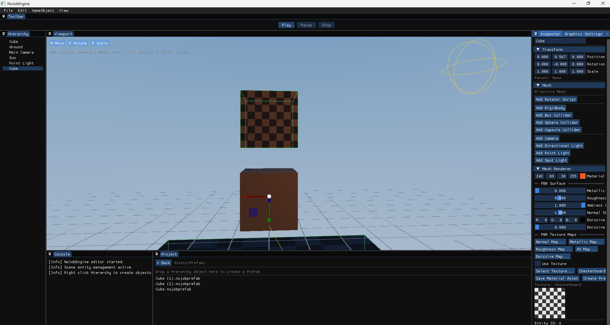

# NoJobEngine

**A lightweight C++ game engine and Unity-inspired editor built from scratch as a learning and engineering project.**

NoJobEngine started with a simple goal: understand what sits underneath a modern game engine by building the important pieces myself instead of treating the engine as a black box. The project has grown from rendering a first triangle into a usable editor/runtime foundation with scenes, assets, prefabs, physics, lighting, PBR rendering and an asset import workflow.

> **Current milestone: NoJobEngine V1.0**  
> The V1 foundation is complete and validated. From this point forward, development is focused on improving existing systems and adding more advanced engine features.


<p align="center">
  
</p>

<p align="center">
  <strong>C++20 · OpenGL · Dear ImGui · Jolt Physics · Assimp</strong>
</p>

---

## Why I built it

I have spent several years working with Unity and C#, both on interactive applications and real-world projects. NoJobEngine is my way of going deeper into engine architecture, graphics programming and modern C++.

The goal is **not to clone Unity feature-for-feature**. Instead, the editor intentionally follows familiar Unity-style workflows while the underlying systems are implemented and explored from the ground up.

The project is especially focused on:

- engine and editor architecture;
- real-time rendering;
- asset pipelines and serialization;
- entity/component workflows;
- physics integration;
- runtime/editor separation;
- learning how high-level engine features are built internally.

---


## Editor preview

The V1 editor brings the core workflow together in one place: scene editing, asset management, PBR rendering, prefabs, physics and runtime controls.

### Rendering & graphics settings

<p align="center">
  
</p>

The graphics validation scene is used to test PBR surfaces, emissive rendering, multiple light types and shadow behavior.


### 3D model import

<p align="center">
  
</p>

The asset pipeline can import static 3D models through Assimp and instantiate them directly in the editor. V1 supports formats including FBX, glTF, GLB and OBJ, with imported meshes participating in the same scene, transform, lighting, prefab and serialization workflows as native engine entities.


### PBR material showcase

<p align="center">
  
</p>

The material system exposes different physically based surface properties directly in the editor. This validation scene compares dielectric, metallic, rough and HDR emissive materials while the Graphics Settings panel provides real-time control over exposure, bloom, screen-space ambient occlusion and FXAA.


### Prefab & asset workflow

<p align="center">
  
</p>

Entities can be turned into prefabs directly from the editor. Materials, textures and PBR parameters are exposed through the Inspector and persisted through the asset pipeline.

---

## V1 feature set

### Editor

- Unity-inspired editor layout using Dear ImGui
- Scene Hierarchy and entity parenting
- Inspector
- Project/Asset browser
- Scene viewport
- Translate, rotate and scale gizmos with ImGuizmo
- Numeric Transform editing
- Play, Pause and Stop workflow
- Persistent editor layout
- Camera and light editor gizmos

### Asset pipeline

- Asset registry
- Persistent `.meta` files and asset GUIDs
- Texture assets
- Material assets (`.nojobmat`)
- Prefab assets (`.nojobprefab`)
- Scene assets (`.nojobscene`)
- Project configuration (`.nojobproject`)
- Drag & drop workflows between the Project panel, Hierarchy and Inspector
- Static 3D model importing through Assimp

Supported static model formats include:

`FBX` · `glTF` · `GLB` · `OBJ` · `DAE` · `STL` · `PLY` · `3DS` · `Blend`

### Rendering

- OpenGL 4.6 renderer
- HDR framebuffer
- Cook-Torrance PBR lighting
- Albedo, normal, metallic, roughness, AO and emissive maps
- Directional, point and spot lights
- Directional/spot shadow maps
- Point-light cubemap shadows
- Procedural sky
- Bloom
- Screen-space ambient/contact shading
- FXAA
- ACES tone mapping and exposure control

### Scene & runtime

- Entity-based scene system
- Parent/child transforms
- Scene serialization and loading
- Editor/runtime scene separation
- Native C++ script component
- Prefab creation and instantiation
- Camera components
- Directional, point and spot light components

### Physics

Powered by **Jolt Physics**:

- Static, dynamic and kinematic rigid bodies
- Box, sphere and capsule colliders
- Trigger volumes
- Friction and bounciness
- Raycasts
- Collider visualization in the editor

---

## Technology

| Area | Technology |
| --- | --- |
| Language | C++20 |
| Build system | CMake |
| Graphics | OpenGL 4.6 / GLAD |
| Window & input | GLFW |
| Mathematics | GLM |
| Editor UI | Dear ImGui |
| Gizmos | ImGuizmo |
| Physics | Jolt Physics |
| Model importing | Assimp |
| Images | stb_image |

---

## Architecture

The renderer is deliberately split into layers so the high-level scene code does not depend directly on OpenGL:

```text
SceneRenderer
    ↓
Renderer
    ↓
RenderCommand
    ↓
RendererAPI
    ↓
OpenGLRendererAPI
```

This also leaves room for another rendering backend in the future.

The project separates the **editor scene** from the **runtime scene**. Entering Play Mode creates a runtime copy, allowing gameplay and physics to modify the world without permanently modifying the editor version of the scene.

Assets have persistent metadata and GUIDs so the asset database is not just a collection of hard-coded file paths.

---

## Typical workflow

```text
Import model
    ↓
Create / assign PBR material
    ↓
Create entities and hierarchy
    ↓
Create prefab
    ↓
Add physics / lights / camera
    ↓
Save scene
    ↓
Play / Pause / Stop
```

The editor is designed to keep this workflow familiar to developers coming from engines such as Unity while remaining small enough for the underlying implementation to be understandable.

---

## Building on Windows

### Requirements

- Windows
- Visual Studio with the **Desktop development with C++** workload
- CMake
- Git
- A GPU/driver with OpenGL 4.6 support

Clone the repository:

```bash
git clone https://github.com/Nil0s/NoJobEngine.git
cd NoJobEngine
```

Configure and build:

```bash
cmake -S . -B out
cmake --build out --config Debug
```

Dependencies are fetched by CMake. The first configuration can therefore take longer than subsequent builds.

> The repository does not require generated build folders such as `out/`, `.vs/` or IDE-specific files to be committed.

---

## Project status

**V1.0 — foundation complete**

The current milestone establishes a stable base rather than attempting commercial-engine feature parity.

Areas I want to explore next include:

- automatic material and texture extraction during FBX/glTF import;
- skeletal animation and an animation system;
- richer prefab variants/overrides;
- Undo/Redo;
- improved asset thumbnails and editor UX;
- renderer profiling and optimization;
- a Vulkan backend;
- audio and VFX systems;
- a game build/export pipeline.

---

## What this project demonstrates

NoJobEngine is both a technical project and a record of my progression beyond using an existing engine API. It covers problems across graphics, tooling, serialization, asset management, physics, architecture and editor/runtime design.

The intention is to keep the codebase practical and iterative: build a system, make it usable from the editor, validate it end-to-end, and then improve it.

---

## Author

**Francisco Ramón Asensi Domingo**

- GitHub: `Nil0s`
- Portfolio: `nil0s.github.io`

---

## License

This repository currently does not declare a project license. Third-party dependencies retain their respective licenses.
