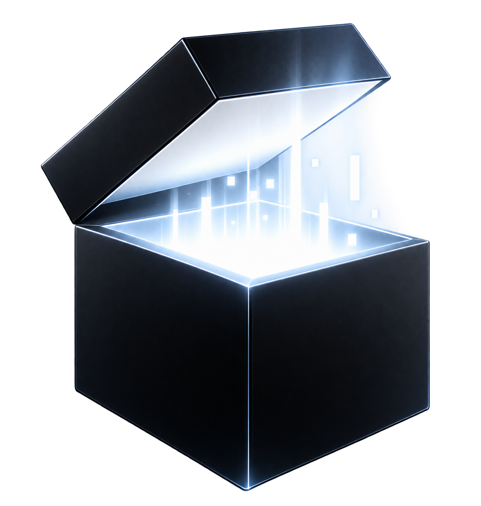

# NoJobEngine

<p align="center">
  
</p>

A custom **C++20 game engine and editor built from scratch as the
foundation for experimenting with native, visual and inspectable Game
AI.**

NoJobEngine started with a simple idea: if I wanted to explore game AI
at a deeper level, I wanted control over the entire stack instead of
treating the engine itself as a black box.

Before building the AI systems I had in mind, I needed the environment
they would live in.

That meant building the engine first.

The project has grown from rendering its first triangle into a complete
editor/runtime foundation with scenes, assets, prefabs, physics, PBR
rendering, skeletal animation, GPU skinning, audio, VFX, native C++
scripting with hot reload and standalone builds.

With the core engine foundation now complete, development is moving into
the original goal of the project:

**Game AI.**

The next stage will explore navigation, perception, visual behavior
authoring, AI debugging and, eventually, native neural networks,
reinforcement learning and training directly inside NoJobEngine.

> **Current milestone: NoJobEngine V1.7 --- Standalone Build ---
> Complete and Validated**
>
> **Next milestone: V1.8 --- AI Navigation & Gameplay AI**

**C++20 · OpenGL 4.6 · Dear ImGui · Jolt Physics · Assimp · miniaudio ·
CMake**

------------------------------------------------------------------------

## Why NoJobEngine exists

I have spent several years working with Unity and C#, both on
interactive applications and real-world projects.

NoJobEngine started from my interest in going deeper into engine
architecture, graphics programming and modern C++, but building another
general-purpose game engine was never the final objective.

The engine is the foundation for a larger experiment:

**What would game AI look like if it were treated as a first-class part
of the engine itself?**

The goal is to explore an AI workflow where developers can build
behaviors visually, inspect what an agent perceives, debug its decisions
and eventually design and train neural networks directly inside the
engine.

Rather than relying on an external Python training pipeline as the core
workflow, the long-term direction is to explore native C++ training and
inference integrated directly with the runtime and editor.

This also opens the door to hybrid approaches where deterministic game
AI and learned behavior can work together in the same agent.

The goal is not to replace Unity, Unreal or Godot. The editor
intentionally keeps some familiar Unity-style workflows, while the
underlying systems are implemented and explored from the ground up.

Building NoJobEngine gives me something more useful for this project:

**control over the editor, runtime, simulation and tooling needed to
explore these ideas from the ground up.**

The engine itself is already a substantial engineering project, focused
on:

-   engine and editor architecture;
-   real-time rendering;
-   asset pipelines and serialization;
-   entity/component workflows;
-   skeletal animation and GPU skinning;
-   physics integration;
-   runtime/editor separation;
-   native C++ gameplay scripting;
-   understanding how high-level engine features are built internally.

Now that foundation becomes the environment for the next stage of the
project.

------------------------------------------------------------------------

## Editor preview

NoJobEngine brings scene editing, asset management, rendering, prefabs,
animation, physics and runtime controls together in a Unity-inspired
editor.

### Rendering & graphics settings

The graphics validation scene is used to test PBR surfaces, emissive
rendering, multiple light types, configurable shadows, HDRI
environments, image-based lighting and post-processing. V1.5 also
introduces a dedicated Renderer Profiler for inspecting frame, CPU/GPU,
geometry and shadow metrics.

### Audio & VFX

V1.6 adds an editor-integrated audio and particle workflow. Audio clips
can be assigned from the Project panel, previewed from the Inspector and
used as 2D or spatial 3D sources. Particle systems expose emitter,
lifetime, randomization, shape, color, size, texture and blending
controls directly in the editor, with Scene gizmos for spatial
authoring.

### Standalone builds

V1.7 turns the editor/runtime separation into a complete Windows
standalone workflow. NoJobEditor can build Debug or Release games
directly from the **Build** menu, compile the runtime and native project
scripts in the same configuration, cook runtime assets and produce a
clean distributable folder that runs independently from Visual Studio
and NoJobEditor.

### 3D model & material import

The asset pipeline imports 3D models through Assimp and can instantiate
them directly in the editor. Imported models support submeshes and
multiple material slots, while material and texture information can be
brought into the NoJobEngine asset workflow.

Supported formats include:

`FBX` · `glTF` · `GLB` · `OBJ` · `DAE` · `STL` · `PLY` · `3DS` · `Blend`

### Skeletal animation & GPU skinning

Animated FBX assets can be imported with their skeleton and animation
clips. NoJobEngine evaluates skeletal animation at runtime and performs
vertex skinning on the GPU.

The current animation workflow includes:

-   skeleton and bone hierarchy import;
-   animation clip/channel import through Assimp;
-   per-vertex bone IDs and weights;
-   GPU skeletal skinning;
-   Animator component;
-   clip selection;
-   playback speed;
-   loop/play controls;
-   Mixamo FBX animation workflow.

### PBR material showcase

The material system exposes physically based surface properties directly
in the editor. Materials support:

-   albedo;
-   normal;
-   metallic;
-   roughness;
-   ambient occlusion;
-   emissive maps;
-   opaque, alpha-clip and transparent surface modes.

### Prefab workflow

Entities and complete hierarchies can be turned into prefabs directly
from the editor.

Prefab V2 supports:

-   recursive entity hierarchies;
-   transforms;
-   meshes;
-   multiple material slots;
-   PBR material properties and textures;
-   Animator data;
-   prefab instantiation;
-   **Apply**;
-   **Revert**.

### Inspector & Add Component

V1.3 introduces a more scalable Inspector and editor workflow. Instead
of exposing scattered component creation buttons, entities use a
centralized **Add Component** menu with search and categories.

The editor now also supports component actions (**Reset / Copy / Paste /
Remove**), Hierarchy and Project search, rename and keyboard shortcuts,
multi-selection, batch duplication/deletion and hierarchy-aware
recursive operations. Duplicating or deleting a parent correctly
processes its full child hierarchy, while Undo/Redo treats the operation
as a single action.

------------------------------------------------------------------------

## Feature set

### Editor

-   Unity-inspired editor layout using Dear ImGui
-   Scene Hierarchy and entity parenting
-   Component-based Inspector
-   Searchable **Add Component** workflow
-   Project/Asset browser
-   Scene viewport
-   Translate, rotate and scale gizmos with ImGuizmo
-   Numeric Transform editing
-   Play, Pause and Stop workflow
-   Persistent editor layout
-   Camera and light editor gizmos
-   Undo/Redo history
-   Material Slots
-   Prefab Apply/Revert
-   Hierarchy and Project search
-   Entity rename and editor shortcuts
-   Multi-selection
-   Batch Duplicate/Delete
-   Recursive hierarchy-aware duplication/deletion
-   Component Reset / Copy / Paste / Remove
-   Audio clip drag & drop and Inspector preview
-   Spatial-audio range/listener gizmos
-   Particle-system authoring and emitter-shape gizmos
-   Build Standalone (Debug / Release) directly from the editor
-   asynchronous standalone build output in the editor Console

### Asset pipeline

-   Asset registry
-   Persistent `.meta` files and asset GUIDs
-   Texture assets
-   Audio assets (`WAV`, `MP3`, `FLAC`)
-   Material assets (`.nojobmat`)
-   Prefab assets (`.nojobprefab`)
-   Scene assets (`.nojobscene`)
-   Project configuration (`.nojobproject`)
-   Drag & drop workflows
-   3D model importing through Assimp
-   Automatic material/texture import workflow
-   Submeshes
-   Multiple materials per mesh
-   Embedded/external FBX texture handling
-   Alpha clip and transparent materials
-   runtime asset cooking from the configured Start Scene
-   standalone runtime asset manifest generation
-   clean packaged `RuntimeData` for native project scripts

### Animation

-   Assimp skeleton import
-   Bone hierarchy and inverse-bind data
-   Animation clips and channels
-   Position, rotation and scale keyframes
-   Per-vertex bone IDs and weights
-   Runtime pose evaluation
-   GPU skinning
-   Animator component
-   Clip selection
-   Speed, Play and Loop controls
-   Mixamo-compatible FBX workflow
-   Animator persistence in Prefab V2

### Rendering

-   OpenGL 4.6 renderer
-   Layered renderer architecture
-   HDR framebuffer
-   Cook-Torrance PBR lighting
-   Albedo, normal, metallic, roughness, AO and emissive maps
-   Multi-material/submesh rendering
-   Directional, point and spot lights
-   Directional/spot shadow maps
-   Point-light cubemap shadows
-   Skinned mesh rendering in the PBR and shadow passes
-   Procedural sky
-   HDRI environment workflow
-   Equirectangular HDRI to cubemap conversion
-   Image-based lighting (IBL)
-   Irradiance maps for diffuse environment lighting
-   GGX prefiltered environment maps for specular reflections
-   BRDF integration LUT
-   Environment intensity and rotation controls
-   Configurable Low / Medium / High shadow quality
-   Dedicated Renderer Profiler
-   CPU and non-blocking GPU render timing
-   Draw-call, triangle and shadow-pass statistics
-   Cached environment precomputation
-   Shadow-map reuse for secondary Camera Preview rendering
-   Bloom
-   Screen-space ambient/contact shading
-   FXAA
-   ACES tone mapping
-   Exposure control
-   Alpha clipping and transparency

### Scene & runtime

-   Entity-based scene system
-   Parent/child transforms
-   Scene serialization and loading
-   Editor/runtime scene separation
-   Native C++ project scripting
-   Script lifecycle (`OnCreate`, `OnUpdate`, `OnDestroy`)
-   Script creation/opening from the editor
-   Asynchronous incremental script compilation
-   Versioned DLL/PDB hot reload
-   Inspector-exposed native C++ fields
-   Script field persistence and hot-reload migration
-   Prefab creation and instantiation
-   Prefab Apply/Revert
-   Camera components
-   Directional, point and spot light components
-   dedicated `NoJobRuntime` executable without editor/ImGui
    dependencies
-   project-relative Start Scene loading
-   standalone native C++ script loading from packaged DLLs
-   Debug and Release standalone builds
-   final package validation against development/source artifacts

### Audio

Powered by **miniaudio** behind NoJobEngine's own `AudioEngine`
abstraction:

-   `AudioSourceComponent` and `AudioListenerComponent`;
-   WAV, MP3 and FLAC playback;
-   Play On Awake, Loop, Volume and Pitch;
-   2D / spatial 3D audio;
-   Unity-style Spatial Blend;
-   world-transform synchronized sources and listeners;
-   Min / Max Distance attenuation;
-   Doppler factor;
-   editor audio preview;
-   audio assets in the Project panel;
-   drag & drop clip assignment;
-   spatial source/listener gizmos;
-   Scene and Prefab persistence.

### Particle VFX

-   `ParticleSystemComponent`;
-   CPU particle simulation separated from rendering;
-   Point, Sphere and Cone emitter shapes;
-   lifetime, speed, size, gravity and emission controls;
-   random lifetime, speed and size variation;
-   Start → End color over lifetime;
-   Start → End size scaling;
-   textured camera-facing billboards;
-   Alpha and Additive blending;
-   Scene emitter-shape gizmos;
-   hierarchy/world-transform aware emitters;
-   GPU-instanced rendering with approximately one draw call per active
    emitter;
-   particle triangle/draw-call integration with Renderer Profiler;
-   explicit renderer resource shutdown;
-   Scene and Prefab persistence.

### Physics

Powered by **Jolt Physics**:

-   Static, dynamic and kinematic rigid bodies
-   Box, sphere and capsule colliders
-   Trigger volumes
-   Friction and bounciness
-   Raycasts
-   Collider visualization in the editor

------------------------------------------------------------------------

## Technology

  Area                          Technology
  ----------------------------- ---------------------------------------
  Language                      C++20
  Build system                  CMake
  Graphics                      OpenGL 4.6 / GLAD
  Window & input                GLFW
  Mathematics                   GLM
  Editor UI                     Dear ImGui
  Gizmos                        ImGuizmo
  Physics                       Jolt Physics
  Model & animation importing   Assimp
  Audio                         miniaudio / AudioEngine
  Particle VFX                  CPU simulation / OpenGL instancing
  Native scripting              C++ / ScriptRegistry / DLL hot reload
  Images                        stb_image

------------------------------------------------------------------------

## Architecture

The renderer is deliberately split into layers so high-level scene code
does not depend directly on OpenGL:

``` text
SceneRenderer
    ↓
Renderer
    ↓
RenderCommand
    ↓
RendererAPI
    ↓
OpenGLRendererAPI
```

This architecture leaves room for another rendering backend in the
future.

Audio follows the same abstraction principle:

``` text
AudioSource / AudioListener
        ↓
AudioEngine
        ↓
miniaudio
        ↓
Platform audio backend
```

Particle simulation lives in `Scene`, while `SceneRenderer` consumes the
runtime particle data and renders camera-facing billboards using GPU
instancing. This keeps gameplay state independent from OpenGL.

The project also separates the **editor scene** from the **runtime
scene**. Entering Play Mode creates a runtime copy, allowing gameplay,
animation and physics to modify the world without permanently changing
the editor version of the scene.

Assets have persistent metadata and GUIDs so the asset database is not
simply a collection of hard-coded file paths.

------------------------------------------------------------------------

## Standalone build pipeline

V1.7 introduces a dedicated runtime executable and a build pipeline
owned by NoJobEditor:

``` text
NoJobEditor
    ↓
Build Standalone (Debug / Release)
    ↓
CMake builds NoJobRuntime
    +
NoJobProjectScripts
    ↓
Start Scene dependency cooking
    ↓
Package validation
    ↓
Builds/<ProjectName>/
    ├── <ProjectName>.exe
    ├── <Project>.nojobproject
    ├── NoJobRuntimeAssets.manifest
    ├── Assets/
    └── RuntimeData/
        └── ProjectScripts/
```

The generated game runs independently from Visual Studio and the editor.
Development folders and C++ source files are excluded from the
distributable, while native project scripts are shipped as the matching
Debug/Release DLL.

------------------------------------------------------------------------

## Typical workflow

``` text
Import FBX / model
        ↓
Import materials & textures
        ↓
Create entities / hierarchy
        ↓
Configure materials / Animator
        ↓
Add components
        ↓
Create prefab
        ↓
Add physics / lights / camera
        ↓
Configure audio / particle VFX
        ↓
Create / compile native C++ scripts
        ↓
Hot reload & configure script fields
        ↓
Save scene
        ↓
Play / Pause / Stop
        ↓
Build Standalone
        ↓
Run packaged game
```

The editor is designed to keep this workflow familiar to developers
coming from engines such as Unity while remaining small enough for the
underlying implementation to be understandable.

------------------------------------------------------------------------

## Native C++ scripting

V1.4 introduces a complete **Native Scripting V2** workflow for writing
gameplay code directly in C++ while keeping iteration inside the editor.

Project scripts can be created from the Project panel, opened directly
in Visual Studio, compiled from NoJobEngine and hot-reloaded without
restarting the editor.

The current workflow includes:

-   reusable `Script` base class;
-   `OnCreate`, `OnUpdate` and `OnDestroy` lifecycle methods;
-   project-level C++ script assets under `Assets/Scripts`;
-   automatic script registration through `ScriptRegistry`;
-   **Create C++ Script** editor workflow;
-   direct opening of scripts in Visual Studio;
-   in-editor script compilation with `Ctrl+Shift+B`;
-   asynchronous compilation with build output in the editor Console;
-   CMake/MSBuild incremental builds that recompile changed scripts
    only;
-   generation-versioned DLL/PDB outputs for reliable repeated hot
    reloads;
-   DLL discovery, unloading and runtime reloading;
-   Inspector-exposed native fields for `float`, `int`, `bool` and
    `glm::vec3`;
-   lightweight native field metadata through `NOJOB_FIELD`;
-   real C++ member values synchronized with the Inspector;
-   Scene/Prefab persistence for exposed script values;
-   Undo/Redo integration for Inspector field editing;
-   hot-reload field migration that preserves compatible values when
    script definitions change.

A typical project script can expose real C++ members directly to the
editor:

``` cpp
class PlayerMovement final : public Script
{
public:
    float Speed = 5.0f;
    float JumpForce = 8.0f;
    bool CanJump = true;
    glm::vec3 Direction{ 1.0f, 0.0f, 0.0f };

    void OnCreate() override;
    void OnUpdate(float deltaTime) override;
    void OnDestroy() override;
};
```

The fields are registered with the native scripting metadata layer:

``` cpp
NOJOB_REGISTER_SCRIPT(PlayerMovement, "Gameplay",
    NOJOB_FIELD(PlayerMovement, Speed),
    NOJOB_FIELD(PlayerMovement, JumpForce),
    NOJOB_FIELD(PlayerMovement, CanJump),
    NOJOB_FIELD(PlayerMovement, Direction))
```

After compilation, these members appear in the Inspector and remain the
actual C++ values used by the runtime script. Compatible Inspector
values are preserved across recompilation and hot reload.

------------------------------------------------------------------------

## Building on Windows

### Requirements

-   Windows
-   Visual Studio with the **Desktop development with C++** workload
-   CMake
-   Git
-   A GPU/driver with OpenGL 4.6 support

Clone the repository:

``` bash
git clone https://github.com/Nil0s/NoJobEngine.git
cd NoJobEngine
```

Configure and build:

``` bash
cmake -S . -B out
cmake --build out --config Debug
```

Dependencies are fetched by CMake. The first configuration can therefore
take longer than subsequent builds.

> Generated folders such as `out/`, `.vs/` and IDE-specific build files
> should not be committed.

### Building a standalone game

Once NoJobEditor is running, standalone builds are created from:

``` text
Build → Build Standalone (Debug)
Build → Build Standalone (Release)
```

The resulting distributable is written to:

``` text
Builds/<ProjectName>/
```

The build pipeline compiles `NoJobRuntime` and `NoJobProjectScripts`
using the same configuration, cooks the Start Scene runtime
dependencies, packages only the required native script DLL and validates
that development/source artifacts have not leaked into the distribution.

------------------------------------------------------------------------

## Development status

### ✅ V1.0 --- Engine foundation

Core editor/runtime architecture, scenes, assets, physics,
cameras/lights, PBR rendering, shadows and post-processing.

### ✅ V1.1 --- Asset Pipeline V2 + Undo/Redo

Multi-material meshes, submeshes, improved model/material importing,
Material Slots, alpha surfaces and editor Undo/Redo.

### ✅ V1.2 --- Animation + Prefab V2

Skeletal animation, GPU skinning, Mixamo workflow, Animator component
and recursive prefabs with materials, animation data, Apply and Revert.

### ✅ V1.3 --- Editor UX

Completed and validated.

-   Centralized searchable **Add Component** workflow with categories.
-   Component **Reset / Copy / Paste / Remove** actions.
-   Transform protected as a mandatory component.
-   Hierarchy search and Project search/filtering.
-   Entity rename workflow.
-   Keyboard shortcuts including F2, Ctrl+D, Delete, Ctrl+Z/Ctrl+Y and
    Escape.
-   Multi-selection with active-entity Inspector editing.
-   Batch Duplicate/Delete with single-step Undo/Redo.
-   Multi-entity parenting and unparenting.
-   Recursive hierarchy-aware duplication and deletion.
-   Parent + child selections are handled without duplicating or
    deleting a branch twice.
-   Duplicated hierarchies preserve child relationships, transforms and
    supported components.

### ✅ V1.4 --- Native Scripting V2

Completed and validated.

-   Reusable native `Script` base class.
-   `OnCreate`, `OnUpdate` and `OnDestroy` lifecycle.
-   Project C++ scripts under `Assets/Scripts`.
-   Script creation directly from the Project panel.
-   Direct Visual Studio integration for script editing.
-   Native script registration through `ScriptRegistry`.
-   In-editor compilation with `Ctrl+Shift+B`.
-   Asynchronous compilation and editor Console output.
-   Incremental CMake/MSBuild script builds.
-   Generation-versioned DLL/PDB hot reload.
-   Repeated hot reload without restarting NoJobEngine.
-   Inspector-exposed `float`, `int`, `bool` and `glm::vec3` fields.
-   Lightweight `NOJOB_FIELD` native reflection metadata.
-   Inspector values mapped to the real C++ script members.
-   Scene/Prefab persistence and Undo/Redo support for script fields.
-   Hot-reload schema migration preserving compatible Inspector values.

### ✅ V1.5 --- Renderer V3

Completed and validated.

-   HDRI environment loading and sky rendering.
-   Physical image-based lighting using irradiance, GGX prefiltering and
    a BRDF integration LUT.
-   Improved PBR environment reflections driven by metallic and
    roughness.
-   Shared procedural/HDRI environment controls with intensity and
    rotation.
-   Configurable IBL, diffuse IBL and specular IBL strengths.
-   Directional, spot and point-light shadow improvements.
-   Low / Medium / High shadow quality presets.
-   Dedicated **Renderer Profiler** editor window.
-   FPS, frame time, Scene CPU/GPU time, draw-call and triangle
    statistics.
-   Shadow-pass, shadow draw-call and shadow-triangle statistics.
-   Non-blocking OpenGL GPU timing queries.
-   Cached HDRI environment resources.
-   Camera Preview shadow-map reuse to avoid rebuilding shadow maps
    twice in the same frame.
-   Reduced redundant world-transform work during rendering.
-   Restored OpenGL framebuffer/viewport state after environment
    precomputation.
-   Safe `stb_image` vertical-flip state restoration after HDR loading.
-   Project-relative HDRI paths for portable in-project environments.

### ✅ V1.6 --- Audio & VFX

Completed and validated.

-   `AudioEngine` abstraction using miniaudio as the internal backend.
-   AudioSource and AudioListener components.
-   WAV, MP3 and FLAC asset playback.
-   Play On Awake, Loop, Volume and Pitch.
-   2D and spatial 3D audio with Spatial Blend.
-   world-space AudioSource and AudioListener synchronization.
-   Min / Max Distance attenuation and Doppler controls.
-   Project-panel audio assets, drag & drop assignment and Inspector
    preview.
-   spatial-audio range and listener-direction gizmos.
-   Scene and Prefab persistence for audio.
-   ParticleSystem component and runtime CPU simulation.
-   Point, Sphere and Cone emitters with editor gizmos.
-   lifetime, speed, size, gravity, emission and maximum-particle
    controls.
-   randomized lifetime, speed and size.
-   color and size evolution over particle lifetime.
-   particle textures with Alpha / Additive blending.
-   camera-facing particle billboards.
-   GPU-instanced particle rendering, reducing particle rendering to
    roughly one draw call per active emitter.
-   particle statistics integrated with Renderer Profiler.
-   explicit particle-renderer shutdown to safely release OpenGL
    resources.
-   Scene and Prefab persistence for VFX.
-   final Audio/VFX regression pass completed successfully.

### ✅ V1.7 --- Standalone Build

Completed and validated.

-   dedicated `NoJobRuntime` executable separated from NoJobEditor;
-   `.nojobproject` discovery and project-relative Start Scene loading;
-   Primary Camera driven standalone rendering;
-   standalone scene, physics, audio and particle/VFX runtime;
-   material/texture state persistence through `MATERIAL_V2`;
-   native C++ project scripts working in standalone builds;
-   Build Standalone (Debug / Release) directly from NoJobEditor;
-   asynchronous CMake build output in the editor Console;
-   project-name based output under `Builds/<ProjectName>/`;
-   Start Scene dependency-based runtime asset cooking;
-   `NoJobRuntimeAssets.manifest` generation;
-   clean `RuntimeData/ProjectScripts` packaging without C++ source
    code;
-   packaged script discovery from serialized `SCRIPT_V2` scene data;
-   matching Debug/Release compilation for Runtime and ProjectScripts;
-   exclusion of PDB/LIB/OBJ and other development artifacts;
-   automatic standalone package validation;
-   final Debug and Release regression passes completed successfully.

------------------------------------------------------------------------

## AI Roadmap

> **Planned development:** the milestones below describe the next stages
> of NoJobEngine and are not presented as implemented until they move
> into the completed development milestones above.

### V1.8 --- AI Navigation & Gameplay AI

Build the deterministic AI foundation directly into NoJobEngine:

-   NavMesh generation and visualization.
-   A\* pathfinding.
-   NavAgent component.
-   Perception system and Blackboard.
-   Behavior Trees.
-   Visual Behavior Tree editor.
-   Native Scripting integration.

### V1.9 --- Native Machine Learning

Build the ML stack **natively in C++ without requiring Python for
training**:

-   Tensor/data representation and Dense layers.
-   Activation functions and forward propagation.
-   Backpropagation and loss functions.
-   SGD and Adam optimizers.
-   Model serialization.
-   Native CPU inference and training.
-   Neural-network editor/visualization tools.

The objective is to understand and implement the ML pipeline inside the
engine instead of treating an external framework as a black box.

### V2.0 --- ML Agents & Reinforcement Learning

Connect native ML to gameplay:

-   MLAgent component.
-   Observations, actions and rewards.
-   Episodes and environment resets.
-   Reinforcement-learning training loop.
-   Runtime trained-policy inference.
-   Parallel/headless simulation for faster training.

Target AI architecture:

``` text
Behavior Tree        → high-level behaviour
        ↓
Neural Network       → learned decisions
        ↓
NavAgent / NavMesh   → movement and navigation
        ↓
Perception           → world sensing
        ↓
Blackboard           → shared AI state
        ↓
Native Scripting     → custom gameplay logic
```

This gives NoJobEngine both authored game AI and agents that can be
trained directly inside the C++ engine.

------------------------------------------------------------------------

## Longer-term exploration

-   Vulkan backend.
-   Terrain.
-   Networking.
-   More advanced asset cooking, compression and build profiles.
-   Dedicated profiling tools.
-   Animation state machines, transitions and blend trees.
-   More advanced scripting/hot reload.
-   AI-assisted editor tooling through a controlled Engine/Scene command
    API.

------------------------------------------------------------------------

## What this project demonstrates

NoJobEngine is both a technical project and a record of my progression
beyond using an existing engine API.

It covers problems across:

-   graphics programming;
-   editor tooling;
-   ECS/component workflows;
-   serialization;
-   asset management;
-   skeletal animation;
-   GPU skinning;
-   physics integration;
-   native scripting;
-   HDRI and image-based lighting;
-   renderer profiling and optimization;
-   audio-engine abstraction and spatial audio;
-   particle simulation, VFX tooling and GPU instancing;
-   engine architecture;
-   editor/runtime design;
-   standalone runtime architecture, asset cooking and release
    packaging.

The development approach is intentionally iterative: **build a system,
expose it through the editor, validate it end-to-end, and then improve
it.**

------------------------------------------------------------------------

## Author

**Francisco Ramón Asensi Domingo**

-   GitHub: `Nil0s`
-   Portfolio: `nil0s.github.io`

------------------------------------------------------------------------

## License

This repository currently does not declare a project license.
Third-party dependencies retain their respective licenses.
